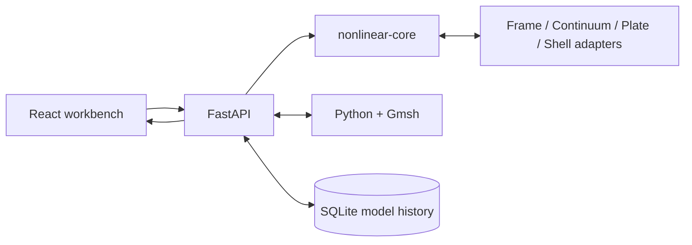

<div align="center">

# Nonlinear Studio / nonlinear-core

**Model 2D Frame, Continuum, Plate, and Shell problems, then follow nonlinear equilibrium — in the browser.**

React workbench · FastAPI · Python nonlinear FE core · Gmsh surface meshing

### [🚀 Try Nonlinear Studio Online →](https://nonlinear.feizhang233.com)

</div>

---

## Quick start

**Requirements:** Python `3.11+` · Node.js `22+` · npm

```bash
# 1. Clone the repository
git clone https://github.com/feizhang233/2D-Nonlinear-Project.git
cd 2D-Nonlinear-Project

# 2. Install the Python core and API
python3 -m venv .venv
source .venv/bin/activate          # Windows: .venv\Scripts\Activate.ps1
python -m pip install --upgrade pip
python -m pip install -e ".[dev]"

# 3. Install the frontend
npm --prefix frontend ci
```

Start the API:

```bash
nonlinear-api
```

Start the workbench in a second terminal:

```bash
npm --prefix frontend run dev
```

Open in the browser:

| Service | URL |
| --- | --- |
| **Nonlinear Studio** | http://127.0.0.1:5173 |
| Swagger UI | http://127.0.0.1:8000/docs |
| Health | http://127.0.0.1:8000/health |

> An account is not required for modeling, meshing, analysis, JSON import, or JSON export. Registration and login add a private, server-side model history. Guest models are not saved.

> **What you see first:** Nonlinear Studio opens with a shallow-arch Frame verification model. Frame, Continuum, Plate, and Shell are separate workspaces. Edit through the model tree, forms, or graphical canvas, then Apply or Cancel the staged changes before running the analysis. Completed solves open in the separate Results mode.

---

## Features

| Area | What you get |
| --- | --- |
| Four model families | One workflow for nonlinear Frame, Continuum, Plate, and flat-Shell models |
| Visual modeling | Model tree and forms as the primary editor, graphical canvas editing, transactional Apply/Cancel, editable Frame topology, and visible read-only surface meshes |
| Nonlinear solution | Full or modified Newton, load/displacement control, line search, adaptive stepping, cutback, and spherical arc length |
| State safety | Trial, commit, rollback, restart, rejected-step history, and model provenance |
| Meshing | Gmsh-backed all-Q4 remeshing for Continuum, Plate, and flat-Shell boundaries |
| Distributed loads | Consistent member, edge, and surface load conversion for supported formulations |
| Results | Deformation, reactions, element response, convergence history, failures, and load-displacement paths |
| Identity and models | HttpOnly sessions, user-isolated SQLite history, and a no-save guest mode |
| API and scripting | Versioned validation, meshing, synchronous/asynchronous analysis, cancellation, and an importable Python core |
| Step 2 Math Core | Bounded browser/API access to buckling, instability, constitutive, and general-shell reference operations |

---

## Typical workflow

1. **Geometry** — choose a family and edit nodes, boundaries, or elements
2. **Material** — define the formulation-specific elastic properties
3. **Supports** — restrain the active degrees of freedom
4. **Loads** — add nodal, member, edge, or surface loading supported by the family
5. **Mesh** — retain explicit Frame members or generate an all-Q4 surface mesh
6. **Solve** — select the control method, target load factor, increments, tolerances, and globalization options
7. **Review** — inspect convergence, rejected steps, reactions, recovered response, and provenance; then export or save

Changing the model invalidates stale results. A trial state becomes committed only after global convergence; rejected steps roll back before the next attempt.

---

## Analysis scope

| Family | Verified nonlinear formulation | Degrees of freedom | Current boundary |
| --- | --- | --- | --- |
| Frame | 2-node corotational Euler–Bernoulli | `UX`, `UY`, `RZ` | Large rigid rotation, small strain; no shear deformation or inelasticity |
| Continuum | Total Lagrangian Q4 with Saint-Venant–Kirchhoff elasticity | `UX`, `UY` | Plane strain only; no mixed formulation, plasticity, or contact |
| Plate | von Kármán Q4 membrane response with MITC4 transverse shear | `UX`, `UY`, `UZ`, `RX`, `RY` | Moderate rotation, small strain; no arbitrary finite rotation |
| Shell | 6-DOF corotational flat Q4 with Reissner–Mindlin/QLLL response and drilling stabilization | `UX`, `UY`, `UZ`, `RX`, `RY`, `RZ` | Initially flat surfaces; no general curved-shell formulation |

The project is intended for learning, prototyping, formula review, and independent verification. Check assumptions, units, mesh sensitivity, convergence behavior, and equilibrium before using results for engineering decisions.

---

## Solver contract

The project uses one residual and Newton sign convention throughout:

$$
\mathbf r = \mathbf f_{ext} - \mathbf f_{int},
$$

$$
\mathbf K_t =
\frac{\partial \mathbf f_{int}}{\partial \mathbf u}
-
\frac{\partial \mathbf f_{ext}}{\partial \mathbf u},
\qquad
\mathbf K_t\,\delta\mathbf u = \mathbf r.
$$

Each model adapter evaluates the current trial displacement and load factor, then returns internal force, tangent, external force, trial state, and recoverable element response. The shared core owns increment selection, Newton iteration, convergence checks, cutback, commit, rollback, and restart state.

Supported solution strategies include:

- full and modified Newton–Raphson;
- load control and displacement control;
- backtracking line search;
- adaptive increment growth, cutback, and retry;
- basic spherical arc-length continuation;
- synchronous execution and local in-process asynchronous polling/cancellation.

---

## Architecture



The browser communicates with the HTTP API. The nonlinear core remains solver-led: family adapters supply model-specific internal response and tangent information without importing the sibling applications. Gmsh supplies surface mesh topology; the nonlinear element formulations and solution controls remain in this repository.

---

## Commands

| Task | Command |
| --- | --- |
| Start the API | `nonlinear-api` |
| Start the frontend | `npm --prefix frontend run dev` |
| Run Python tests | `python -m pytest` |
| Lint Python | `python -m ruff check src tests scripts` |
| Run frontend tests | `npm --prefix frontend test` |
| Check frontend types | `npm --prefix frontend run typecheck` |
| Build the frontend | `npm --prefix frontend run build` |
| Check generated contracts | `python scripts/generate_schema.py && python scripts/generate_openapi.py` |
| Check numerical audit | `python scripts/run_math_core_audit.py --check` |
| Check release evidence | `python scripts/generate_release_evidence.py --check && python scripts/check_release.py` |

| Variable | Default | Purpose |
| --- | --- | --- |
| `NONLINEAR_DATA_DIR` | `frontend/.nonlinear-data` | SQLite accounts, sessions, and saved models |
| `NONLINEAR_COOKIE_SECURE` | auto-detected | Set to `1` when HTTPS terminates outside the application |
| `NONLINEAR_CORS_ORIGINS` | empty | Comma-separated allowed browser origins |

The default synchronous API limit is 1 MiB per request and 10,000 degrees of freedom. The Gmsh endpoint limits interactive surface meshes to 10,000 nodes.

---

## API cheat sheet

| Method | Path | Description |
| --- | --- | --- |
| `GET` | `/health` | Service, version, execution modes, and limits |
| `POST` | `/api/v1/models/validate` | Validate a versioned model and report execution eligibility |
| `POST` | `/api/v1/meshes` | Generate a named-boundary Q4 surface mesh with Gmsh |
| `GET` | `/api/v1/math-cores` | List Step 2 cores, operations, contracts, examples, and HTTP limits |
| `GET` | `/api/v1/math-cores/{core_id}` | Read one Step 2 core contract |
| `POST` | `/api/v1/math-cores/execute` | Execute one bounded reference operation through the stable envelope |
| `POST` | `/api/v1/analyses` | Run or queue an analysis |
| `GET` | `/api/v1/analyses/{analysis_id}` | Read status, result, history, and diagnostics |
| `DELETE` | `/api/v1/analyses/{analysis_id}` | Request cooperative cancellation |
| `POST` | `/api/v1/auth/register` | Create an account and start a session |
| `POST` | `/api/v1/auth/login` | Sign in and start a session |
| `GET` | `/api/v1/auth/session` | Read the current session |
| `POST` | `/api/v1/auth/logout` | Revoke the current session |
| `GET` / `POST` | `/api/v1/models` | List or save user-owned models |
| `DELETE` | `/api/v1/models/{entry_id}` | Delete one user-owned history entry |

Validation, meshing, and analysis remain available to guests. Saved-model endpoints require a signed-in session and enforce ownership on every operation. Model history retains up to 24 snapshots per account.

Math Core operations are also available to guests. Their results are reference evidence only and never mutate the active model, staged edits, solver run, or Results workspace. The HTTP bridge limits parameters to 10,000 values and 12 nesting levels in addition to the global 1 MiB request limit; operation-level failures retain the stable `MathCoreResponse` error envelope. See [`Step 2 Math Core/INTERFACE.md`](Step%202%20Math%20Core/INTERFACE.md) for the complete contract.

---

## Units and model data

Every model declares its length, force, stress, and angle units. The solver treats numerical values as one self-consistent unit system; the unit metadata does not silently rescale inconsistent input.

The public model contract is versioned as `1.0.0`. Unknown fields, duplicate IDs, invalid references, unsupported degrees of freedom, and incompatible load targets are rejected with structured JSON-path errors before execution.

Model and restart JSON preserve:

- solver and schema versions;
- model identity and SHA-256 provenance;
- analysis controls and tolerances;
- committed state and continuation direction;
- iteration, step, failure, and recovery records.

---

## Current limitations

- no contact, friction, dynamics, buckling eigenanalysis, fracture, or localization regularization;
- no production plasticity, damage, composite, or other history-dependent material library;
- no follower/current-configuration distributed loading;
- no general finite-strain plane stress or mixed near-incompressible continuum formulation;
- no general curved nonlinear shells, arbitrary finite-rotation plates, or automatic branch switching;
- no Gmsh domains with holes, multiple exterior loops, non-planar Shell geometry, or residual triangles after recombination;
- no durable distributed task queue or persistent analysis-result store;
- asynchronous analyses are local to one API process and cannot recover queued jobs after shutdown.

---

## Layout

```text
frontend/                 React + TypeScript + Vite workbench
src/nonlinear_core/       Contracts, nonlinear solvers, state, adapters, and elements
src/nonlinear_api/        FastAPI schemas, IAM, meshing, analysis service, and ASGI app
src/reused_cores/         Provenance-tracked reusable linear Frame subset
tests/unit/               Contract, algebra, solver, state, and convergence tests
tests/verification/       V00–V09 numerical verification
tests/integration/        API, adapter, meshing, release, and cross-layer tests
tests/fixtures/           Tracked model and release inputs required by automated gates
schemas/                  Versioned ModelInput JSON Schema and OpenAPI contract
scripts/                  Contract generation, audit, release, wheel, and HTTP smoke gates
.github/workflows/        Frozen dependency revisions and backend/frontend CI
```

---

## Contributing

Issues and pull requests are welcome. Before submitting a change, run:

```bash
python -m ruff check src tests scripts
python -m pytest
npm --prefix frontend test
npm --prefix frontend run typecheck
npm --prefix frontend run build
```

Current package version: `nonlinear-core 0.1.0`.
