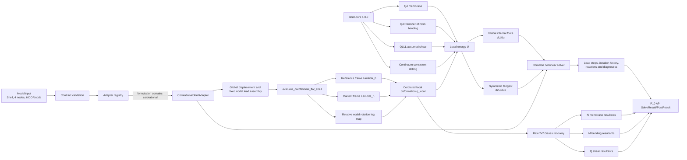

# P14 验收报告与结构图

## 1. 验收结论

**结论：通过。** 2026-08-20 对 P14 共回转平壳任务进行了代码、数值、集成、接口、
构建和边界声明验收。计划中的 P14.1～P14.3 及四项验收门槛均有实现和自动化证据，
未发现阻断 P14 关闭的问题。

本结论只覆盖“初始平面 Q4 壳在大刚体转动、小局部应变和小共回转相对转动下的几何
非线性竖向切片”，不等同于通用非线性曲壳已经完成。

## 2. 验收范围

| 计划要求 | 实现证据 | 验证证据 | 结论 |
|---|---|---|---|
| 共回转平壳，大刚体转动、小局部应变 | `elements/shell_corotational_flat.py` 构造参考/当前局部基并提取相对转动 | 30° 有限刚体转动的局部变形、内力与能量为零 | 通过 |
| 复用 `shell-core` Q4 局部算子 | 复用膜、弯曲、QLLL 剪切和连续体一致 drilling 算子 | 零状态切线与 `shell-core` 全局算子逐项一致；小转动内力误差受控 | 通过 |
| 局部内力和切线映射到全局 | 内力和对称切线由同一共回转能量的一阶/二阶导数得到 | 单元及双单元组装方向差分均出现内部误差谷；虚功一致 | 通过 |
| drilling 参数可见且转动一致 | `alpha_d` 经输入、响应元数据、能量和 Gauss 点记录完整保留 | `alpha_d` 从 `1e-5` 到 `1e-3` 时仅 drilling 能量按 100 倍缩放 | 通过 |
| 保留原始 Gauss 点 `N/M/Q` | 适配器和 API 输出四个 2×2 Gauss 点原始结果 | 集成测试确认无节点平均或派生场覆盖 | 通过 |
| 网格畸变与厚度敏感性 | 规则/畸变 Q4、两种厚度 | `detJ>0`；膜/剪切/drilling 按 `t`、弯曲按 `t^3` 缩放 | 通过 |
| 能进入统一求解与 API 链 | 注册表选择 `CorotationalShellAdapter`，公共求解器和 P10 API 不增加分支 | 示例可由 API 求解，并返回原始 `N/M/Q` | 通过 |
| 适用边界不夸大 | 文档和响应声明 `large-rigid-rotation-small-local-strain` | 非 SI 单位、面荷载等超范围输入被明确拒绝 | 通过 |

## 3. P14 结构图



## 4. 代码目录结构

```text
2D-Nonlinear-Project/
├── src/nonlinear_core/
│   ├── elements/
│   │   └── shell_corotational_flat.py   # 共回转运动学、能量、内力、切线、Gauss 恢复
│   └── adapters/
│       ├── shell_nonlinear.py           # 模型检查、组装、状态和结果映射
│       └── registry.py                  # 线性/共回转 Shell 适配器选择
├── src/nonlinear_api/                   # P10 分析提交与结果发布
├── examples/p14/
│   └── corotational-flat-shell.json     # 单元悬臂壳验收输入
├── tests/
│   ├── unit/test_p14_corotational_flat_shell.py
│   ├── integration/test_p14_shell_adapter.py
│   └── verification/test_v09_corotational_shell.py
├── docs/
│   ├── P14_COROTATIONAL_FLAT_SHELL.md   # 技术设计与适用边界
│   └── P14_ACCEPTANCE_AND_ARCHITECTURE.md
└── 2D-Nonlinear-Project_逐步开发计划.md
```

## 5. 数据与状态流

```text
JSON 输入
  -> ModelInput 合同验证
  -> registry 选择共回转 Shell 适配器
  -> 全局 trial displacement
  -> 单元当前构形与局部变形
  -> shell-core 局部能量与 N/M/Q
  -> 全局内力、切线和残量
  -> Newton / 位移控制 / 弧长公共求解流程
  -> accepted step 才 commit，失败则 rollback/cutback
  -> SolveResult + 原始 Gauss 点 PostResult
  -> P10 API
```

## 6. 本次实际门禁结果

| 门禁 | 结果 |
|---|---|
| P14 专项测试 | 12 项通过：5 unit + 4 integration + 3 verification |
| 全量后端测试 | 188 项收集并全部通过 |
| Python 静态检查 | `ruff check src tests` 通过 |
| Python 发布构建 | sdist 与 wheel 均成功生成 |
| 前端测试 | 3 个测试文件、6 项测试通过 |
| 前端类型检查 | TypeScript `tsc -b` 通过 |
| 前端生产构建 | Vite 构建通过，673 个模块完成转换 |

## 7. 非阻断项与后续边界

- 此项已在 P15 闭环：前端生产包按 React 与 MUI/Emotion 拆分，单个 chunk 均低于
  Vite 默认 `500 kB` 提示阈值。
- 前端已接通六自由度 Shell 面编辑、异步求解和 `N/M/Q` 表格/强度投影；当前仍是 Q4
  工程投影，不是曲壳三维云图后处理器。
- 共回转映射的全局能量梯度与 Hessian 使用显式数值差分，适合本项目受限的小模型和可
  检查实现，但不是工业规模高性能壳单元方案。
- 不支持通用曲壳、任意有限局部转动、有限应变、随动/面荷载、复合材料、塑性、损伤、
  接触、分岔识别或自动分支切换。

## 8. 可追溯入口

- 开发计划：[`../2D-Nonlinear-Project_逐步开发计划.md`](../2D-Nonlinear-Project_逐步开发计划.md)
- P14 技术说明：[`P14_COROTATIONAL_FLAT_SHELL.md`](P14_COROTATIONAL_FLAT_SHELL.md)
- P14 示例：[`../examples/p14/corotational-flat-shell.json`](../examples/p14/corotational-flat-shell.json)
- 验证说明：[`../tests/verification/README.md`](../tests/verification/README.md)
