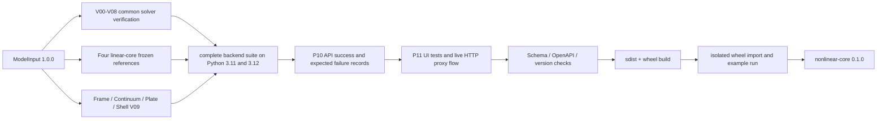

# P15 集成验收与 0.1.0 发布

## 1. 结论

P15 已完成，发布版本冻结为 `nonlinear-core 0.1.0`。验收覆盖 V00-V09、四个原线性核心
参考结果、三种路径控制、成功与预期失败的 API 记录、前端请求闭环、版本/Schema 一致
性、构建产物及隔离 wheel 运行。

“通过”表示计划中声明的受限模型和工作流通过，不表示未实现的通用材料、曲壳、接触、
动力、分岔识别或工业规模计算能力已经具备。

## 2. 发布门禁结构



## 3. P15.1 完整自动化测试

| 要求 | 自动化证据 | 结论 |
|---|---|---|
| V00-V08 | `tests/unit` 与 `tests/verification/test_v01...test_v08` | 通过 |
| 四类 V09 | Frame、Total Lagrangian Continuum、von Karman Plate、corotational flat Shell 四个 V09 文件 | 通过 |
| 四个原线性核心不退化 | `test_p2_linear_adapters.py` 对照冻结的位移、反力、能量、版本与 DOF 顺序 | 通过 |
| API 端到端 | FastAPI `TestClient` 走验证、提交、求解、查询、失败和限制路径 | 通过 |
| 前端端到端 | Material UI 从“运行分析”经过模型验证、分析提交、状态更新到结果显示 | 通过 |

## 4. P15.2 数值交叉验证

| 检查 | 结果 |
|---|---|
| 稳定支路三种控制重合 | 荷载、位移和球形弧长在 `(lambda, u_y)=(0.1, -0.0148011536)` 重合 |
| 极限点失败对照 | 浅拱首个极限约 `lambda=0.296`；荷载控制请求 `0.31` 时失败并保留 `0.25` 的提交状态 |
| snap-back 控制边界 | 独立 `c=x^2` 反例中位移控制返回 `CONTROL_ERROR` 并原样回滚；弧长继续两个接受步 |
| 三档步长 | Frame 使用 `0.02/0.01/0.005`；Continuum 与 Plate 使用 `0.5/0.25/0.125` |
| 多档网格 | Frame 规则/畸变网格；Continuum 和 Plate 使用 `1/2/4` 网格；Shell 使用规则/畸变几何与两档厚度 |

## 5. P15.3 发布检查

| 门禁 | 结果 |
|---|---|
| Ruff | `src`、`tests`、`scripts` 通过 |
| pytest | 本地 Python 3.12 共 `195 passed`；CI 已配置 Python 3.11 与 3.12 完整套件矩阵（本轮未执行远端 CI） |
| 前端 | 3 个文件、7 项测试通过；TypeScript 和 Vite 构建通过 |
| 合同 | JSON Schema 与运行时模型一致；OpenAPI 与运行时应用一致 |
| 版本 | Python 元数据、`nonlinear_core.__version__`、`SolveResult.solver_version` 和前端均为 `0.1.0` |
| 构建 | `nonlinear_core-0.1.0.tar.gz` 与 `nonlinear_core-0.1.0-py3-none-any.whl` 成功 |
| 隔离安装 | 无 `system-site-packages` 的临时 venv 正常解析 wheel 依赖并执行 `pip check`；随后安装四个冻结核心并运行四类公开非线性算例 |
| 全栈 HTTP | 启动真实 API 与 Vite，经过前端代理执行健康检查、模型验证、异步提交、轮询和成功结果检查 |
| 发布证据 | 成功记录 5 步/20 次迭代；失败记录 6 步/53 次迭代及回滚边界 |

## 6. 最终完成门槛

- 四类模型的支持范围在根 README 和各 P9/P12/P13/P14 技术文档中分别声明。
- 每个 `SolveResult` 保留 `model_id`、`model_sha256`、`solver_version`、控制方法、步和迭代。
- 失败结果同时保留拒绝步、失败码、失败迭代及最后提交状态；不会把未收敛试算发布成结果。
- README 和界面均明确四类前端能力及其可视化边界；四类都通过同一 Python/API 合同。
- P15 没有放松既有数值容差。方向差分仍要求内部误差谷和严格误差上限；状态测试仍要求
  回滚对象/哈希或路径严格一致；线性核心仍与冻结参考比较。

## 7. 可复现命令

```bash
.venv/bin/python scripts/generate_release_evidence.py --check
.venv/bin/python scripts/check_release.py
.venv/bin/ruff check src tests scripts
.venv/bin/pytest
.venv/bin/python -m build --no-isolation

cd frontend
npm test -- --run
npm run typecheck
npm run build
```

CI 位于 `.github/workflows/ci.yml`，以固定提交检出四个线性核心，并分别执行后端、发布
产物和前端门禁。本次完成的是本地发布构建和 CI 配置，未执行外部仓库推送或包索引上传。

## 8. 发布示例

- [`../examples/p15/release-success.json`](../examples/p15/release-success.json)：完整输入、
  接受步、迭代、后处理和可追溯版本。
- [`../examples/p15/release-expected-failure.json`](../examples/p15/release-expected-failure.json)：
  完整输入、极限点预期失败、拒绝步、30 次失败迭代和最后提交路径。
- [`../examples/p15/README.md`](../examples/p15/README.md)：生成规则和人工检查入口。

## 9. 非阻断发布说明

- Vite 生产包已拆分为应用、React 和 MUI/Emotion chunks；单个 chunk 均低于默认
  `500 kB` 提示阈值。
- 前端已连接 Frame、Continuum、Plate 和 Shell；Surface 家族为带边界声明的 Q4 工程
  投影与恢复表，不宣称通用三维云图能力。
